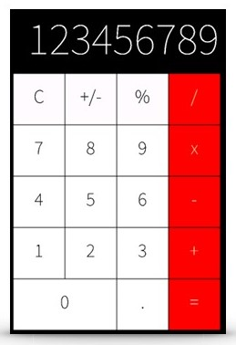

# Курс: «Разработка приложений под мобильные устройства на основе Android»

## Тема: Layout, Views и ресурсы

Необходимо разработать графический интерфейс для приложения калькулятор на основании материала, полученного на лекции.

### Дизайн экрана:

### Требования к работе:

1. Интерфейс должен соответствовать указанному дизайну.
2. Использовать наиболее подходящий контейнер компоновки (рекомендуется `GridLayout`, `TableLayout` или `LinearLayout`).
3. В качестве текстовых значений, размеров и цветов обязательно должны использоваться ресурсы.
4. Все элементы управления должны масштабироваться и выглядеть одинаково на различных устройствах с отличающимися форм-факторами. Это касается и размера текста.
5. Добавить селекторы на нажатие кнопок и различные состояния текстового поля.

### Дополнительные задания:

6. Разработать графический интерфейс приложения для альбомной ориентации.
7. Расширить набор элементов управления на больших экранах (включая планшетные экраны).

> При решении дополнительного задания нет никаких рамок и ограничений на внешний вид и количество компонентов интерфейса. В этой работе преподаватель оценивает умение студента решить поставленную задачу и индивидуальный подход.
